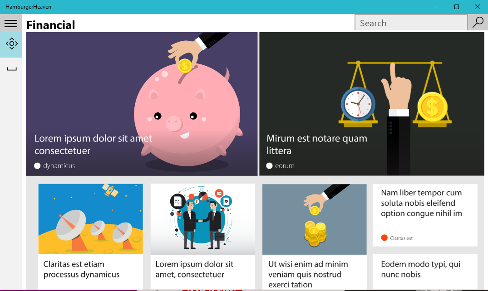
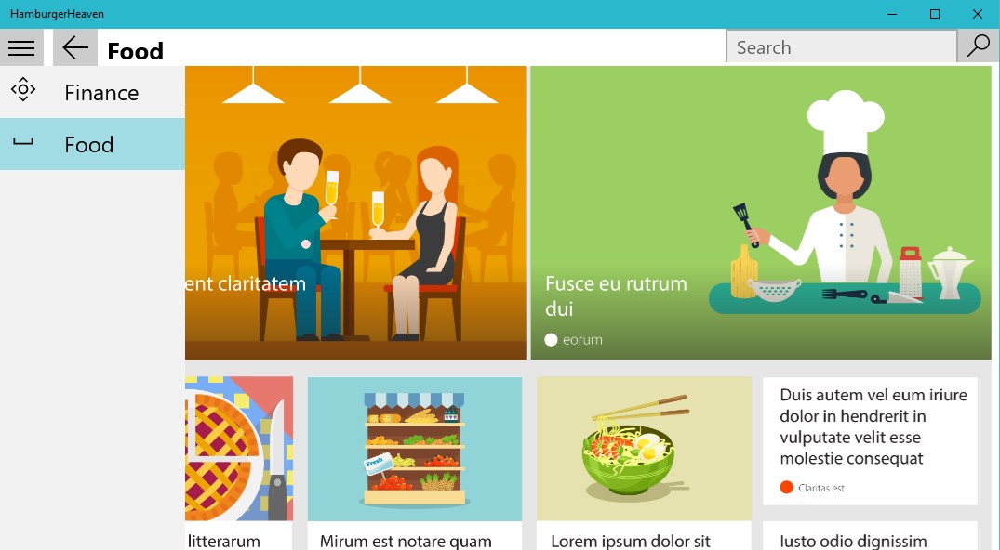

# UWP-HamburgerMenu
A raw implementation of the hamburger menu on the Universal Windows Platform.

Will probably never use this on an actual project, because of the awesome [Template 10](https://github.com/Windows-XAML/Template10) already available.

